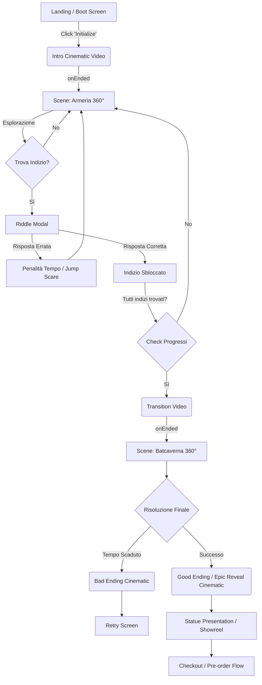

# 🌊 UX_FLOW.md

Questo documento illustra il percorso end-to-end dell'utente all'interno dell'esperienza. L'obiettivo dell'UX Flow è bilanciare un on-boarding fluido con un gameplay ingaggiante, guidando l'utente verso il funnel di conversione finale (il pre-order della statua).

## 1. High-Level Flow Diagram

## 2. Mission Structure & Pacing
Il pacing è progettato per creare un'escalation emotiva:
- **Atto I (Onboarding & Tensione)**: L'utente atterra in un terminale finto. L'interfaccia è minimale. Il primo video setta l'urgenza. L'Armeria serve da "tutorial nascosto" per far capire i comandi (trascina per guardarti intorno, clicca gli hotspot).
- **Atto II (Il Game Loop)**: L'utente entra nel cuore dell'indagine. Il timer scende. Devono esplorare la Batcaverna. Il design degli enigmi richiede logica ma non è impossibile, per evitare eccessiva frustrazione e l'abbandono del sito (bounce rate).
- **Atto III (Climax & Reward)**: Sventata la minaccia, il timer scompare. L'UI cambia da "Tactical/Urgent" a "Premium/Showcase". L'illuminazione si accende, rivelando il prodotto.

## 3. Game Loop Breakdown
1. **Ricerca**: Rotazione della telecamera alla ricerca di elementi anomali (glow rossi o verdi).
2. **Interazione**: Click sull'hotspot. L'HUD esegue un'animazione di "Hacking in progress...".
3. **Sfida**: L'Enigmista pone un indovinello (testo + audio distororto).
4. **Risoluzione**: Risposta a scelta multipla o input testuale.
5. **Feedback**: 
   - *Successo*: Suono di sblocco, elemento UI che si illumina, decodifica completata.
   - *Fallimento*: Schermo che glitcha (CSS Chromatic Aberration), risata del Joker/Enigmista, decurtazione di secondi dal timer.

## 4. Fail State vs Success State
- **Fail State (Game Over)**: Se il timer raggiunge 00:00:00, l'interfaccia viene interrotta bruscamente da un video di esplosione/schermo rosso. L'utente viene reindirizzato a un "Terminal Reboot" con un pulsante "Riprova".
- **Success State (Victory)**: Risolto l'ultimo enigma, un overlay verde conferma il "Override Riuscito". Segue un video cinematografico in cui l'ambiente si illumina drammaticamente per mostrare la statua.

## 5. Reveal Finale e Conversion Flow
L'atterraggio sulla pagina di Reveal segna la fine del gioco e l'inizio dell'e-commerce.
- L'esperienza passa da esplorazione 3D a uno scrolling verticale fluido (Apple-style scroll sequence).
- La statua viene presentata con macro-dettagli, specifiche dei materiali (resina, scala 1:3), e illuminazione dinamica.
- **Call to Action (CTA)**: "SECURE YOUR PRE-ORDER". Fissa in basso o sticky durante lo scroll, sempre accessibile.
- **Checkout**: Form pulito, premium, ispirato al design del lusso, senza distrazioni per massimizzare il conversion rate.
